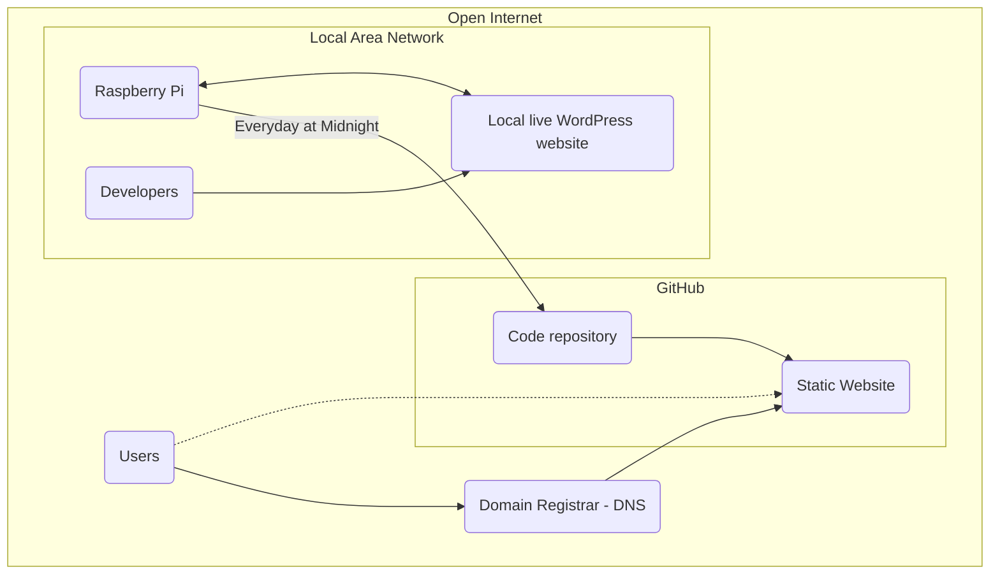

> :warning: **NOTE Site Unpublished**: To re-connect the site, change "main-disabled" to "main" [here](/.github/workflows/static.yml#L7) AND follow instructions [here](#set-up-github-repo)

# thecacklingcrow
The Cackling Crow blog website repository.

# How it works
This repo is used for hosting the [thecacklingcrow.com](https://thecacklingcrow.com/), and also outlines the process of hosting a website for free using GitHub for hosting, WordPress for managing the website content, and a Raspberry Pi for hosting a local editable version of the website. 

## Structure
The diagram below shows how the different part of this project interact with eachother.

## Benefits
- Free (other than optional cost of a domian name)
- Basically the same usage as a regular WordPress site
- Secuity benefits (your live WordPress site won't be accissble from the open internet, only the a static version it will be accessible)
- GitHub will store your website history
- You get a home server that serves to the open internet without having to open your home network to serve a website
- A static IP isn't needed (or the use of a Dynamic DNS service)

## Limitations
- Since this is a static site, users will not be able to leave comments
- No default support for viewing web traffic
- Since it relies on free hosting from GitHub, there is no support and no guaruntee the service will remain availible
- GitHub will store your website history (anyone will be able to see if they find your public repo)

# Use
After you've followed the [Installation](#installation) instructions, you can access your WordPress website through a browser that's connected to the same network as the Raspberry Pi. You can make any changes to your website you'd like using the regular WordPress interface. Once you've saved your changes, your live website will automatically be updated the same day (at midnight).

# Installation
To get your website up and running, follow the steps in the ordered sections below:
1. [Setup the Raspberry Pi](#setup-the-aspberry-pi)
2. [Install Wordpress on the Raspberry Pi](#install-wordpress-on-the-raspberry-pi)
3. [Wordpress setup](#wordpress-setup)
4. [Add URL configuration to the Raspberry Pi Server](#add-url-configuration-to-the-raspberry-pi-server)
5. [Set-up ability to make a static copy of Wordpress to the Raspberry Pi Server](#setup-ability-to-make-a-static-copy-of-wordpress-to-the-raspberry-pi-server)
6. [Set-up GitHub Repo](#setup-github-repo)
7. [Set up a Cron job on the Raspberry Pi](#set-up-a-cron-job-on-the-raspberry-pi)

## Setup the Raspberry Pi
1. Install Raspbian on a raspberry pi
   1. Get a Raspberry Pi. This project used the model 4, but it should work on most models. 
   2. Download and install the Raspbery Pi Imager found [here](https://www.raspberrypi.com/software/)
   3. Use the Raspbery Pi Imager to load "Raspberry Pi OS Lite", the command-line only version of the Raspbian OS to a SD Card. 
   4. Under advanced options: Enable SSH, configure the Wifi if needed, and set a local hostname (eg: `crow.local`)
      For the rest of these instuctions, substiture `crow.local` for whatever you chose as a local hostname
   6. Note the username and password you choose (eg `crow`)
      For the rest of these instuctions, substiture `crow` for whatever you chose as a username on the Pi

## Install Wordpress on the Raspberry Pi
1. SSH into the Raspberry Pi
   1. On a machine connected to the same network as the Raspberry Pi, open a command-line window ("Command Prompt" or "PowerShell" on Windows or "Terminal" on linux or MacOS)
   2. `ssh crow.local -l crow`
   3. You may have to say Yes to add the key as a known ssh host
   4. Enter your password from the section [Setup the Raspberry Pi](#setup-the-aspberry-pi)
2. `sudo apt-get install apache2 -y`
3. `sudo apt-get install php -y`
4. `sudo apt-get install mariadb-server php-mysql -y`
5. `sudo service apache2 restart`
6. `cd /var/www/html/`
7. `sudo rm *`
8. `sudo wget https://wordpress.org/latest.tar.gz`
9.  `sudo tar xzf latest.tar.gz`
10.  `sudo mv wordpress/* .`
11.  `sudo rm -rf wordpress latest.tar.gz`
12.  `sudo chown -R www-data: .`
13.  `sudo mysql_secure_installation`
   1. Enter system root password
   2. `Switch to unix_socket authentication [Y/n] Y`
   3. `Change the root password? [Y/n] Y`
   4. Enter new DB root password
   5. `Remove anonymous users? [Y/n] Y`
   6. `Disallow root login remotely? [Y/n] Y`
   7. `Remove test database and access to it? [Y/n] Y`
   8. `Reload privilege tables now? [Y/n] Y`
14. `sudo mysql -uroot -p`, enter DB root password
    1. `create database wordpress;`
    2. `GRANT ALL PRIVILEGES ON wordpress.* TO 'root'@'localhost' IDENTIFIED BY 'YOURPASSWORD';`, change password (keep quotes)
    3. `FLUSH PRIVILEGES;`
    4. Ctrl + d
15. `sudo reboot`

## Wordpress setup
1. Goto local address (`http://crow.local/`) in your browser (on a device connected to the same network as the Raspberry Pi)
2. Follow wizard
    1. Database Name: wordpress
    2. User Name: root
    3. Password: {DB password} (from the section [Install Wordpress on the Raspberry Pi](#install-wordpress-on-the-raspberry-pi))
    4. Database Host: localhost
    5. Table Prefix:  wp_
3. "Run installation"
    1. Title: The Cackling Crow (change to the title of your site)
    2. user: {wp user} (pick a Wordpress username)
    3. pass: {wp pass} (pick a Wordpress password)
    4. email: {associated email} (enter your existing email address)
4. Login and go to Settings > Permlinks
    1. Set to "Plain" and save
5. Go to Settings > Discussion 
   1. Uncheck the option that says “Allow people to post comments on new articles" (see [Limitations](#limitations))

## Add URL configuration to the Raspberry Pi Server
1. SSH into the Raspberry Pi (see step 1 of the section [Install Wordpress on the Raspberry Pi](#install-wordpress-on-the-raspberry-pi) for more details)
2. `sudo a2enmod rewrite`
3. `sudo systemctl restart apache2`
4. `cd /var/www/html`
5. `sudo echo "#These two lines are edited by a separate script" >> wp-config.php`
6. `sudo echo "define( 'WP_HOME', 'http://crow.local' );" >> wp-config.php`
7. `sudo echo "define( 'WP_SITEURL', 'http://crow.local' );" >> wp-config.php`

## Set-up ability to make a static copy of Wordpress to the Raspberry Pi Server
1. SSH into the Raspberry Pi (see step 1 of the section "Install Wordpress on the Raspberry Pi" for more details)
2. `cd /var/www/html`
3. `wget https://raw.githubusercontent.com/chnm/WP-Static/master/wpstatic`
4. `chmod +x wpstatic`

## Set-up GitHub Repo
1. Sign up for a GitHub account if needed and create a new repository for your website. The Repo must be "Public"
2. Goto the Repo page > Settings (along the top) > Pages (along the side)
3. Under `Build and deployment` Set `Source` to `GitHub Actions`
4. Select `Static HTML By GitHub Actions` as your Workflow
5. Accept the defaults and Commit the changes to your main branch
6. Go back to the Repo page > Settings (along the top) > Pages (along the side)
7. Enter and `Custom domain` if you have one. Follow the linked instuctions there. You will have to configure it with your Domnain name provider as well. 

## Setup Git syncing on the Raspberry Pi
1. SSH into the Raspberry Pi (see step 1 of the section [Install Wordpress on the Raspberry Pi](#install-wordpress-on-the-raspberry-pi) for more details)
1. `sudo apt-get update`
2. `sudo apt-get install git`
3. `ssh-keygen -t ed25519 -C "{associated crow email}"` (your github email)
4. `cat /home/crow/.ssh/id_ed25519.pub`, copy content
5. Add that key as a write access deployment key for the repo on github
   1. In a brower (not the command-line), goto the repo on github.com
   2. Goto the Settings (along the top) > Deploy keys (along the side)
   3. Click `Add Deploy key` and paste the content you coppied above under `Key`
   4. Give it a good name, Allow write access, and click `Add`
   5. Return to the command line window
7. `cd ~`
8. `git config --global user.name "{name}"` (your GitHub username)
9. `git config --global user.email "{associated crow email}"` (your GitHub email)
10. `git clone {repo}` (by sure to use SSH format for repo, see code dropdown button from github repo page)
11. `cd {repo}`
12. Get the `clean.sh` and `update.sh` scripts from this repo (warning: these scripts will autmatically delete everything in your repo that's not part of your site, `.github` config files, the `README.md` file, or these two scripts themselves)
   1. `wget https://raw.githubusercontent.com/abitwitch/thecacklingcrow/main/clean.sh`
   2. `wget https://raw.githubusercontent.com/abitwitch/thecacklingcrow/main/update.sh`
14. `sudo bash ./update.sh` (this will make a copy of the website)

## Set up a Cron job on the Raspberry Pi
1. SSH into the Raspberry Pi (see step 1 of the section [Install Wordpress on the Raspberry Pi](#install-wordpress-on-the-raspberry-pi) for more details)
1. `sudo crontab -e` (you may have you pick a default text editor, I recommend Nano for beginners)
2. add this line `0 0 * * * /usr/bin/bash /home/crow/thecacklingcrow/update.sh` (this will mean the Raspberry Pi will apply any changes you've made to your site locally to the open web at Midnight every night)

